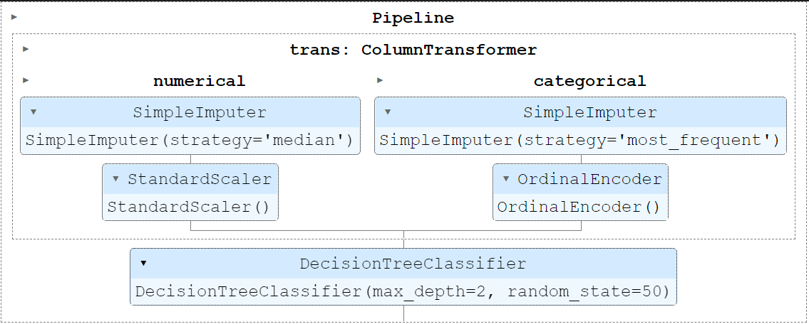
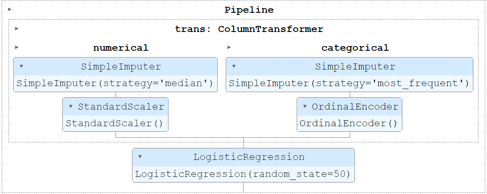
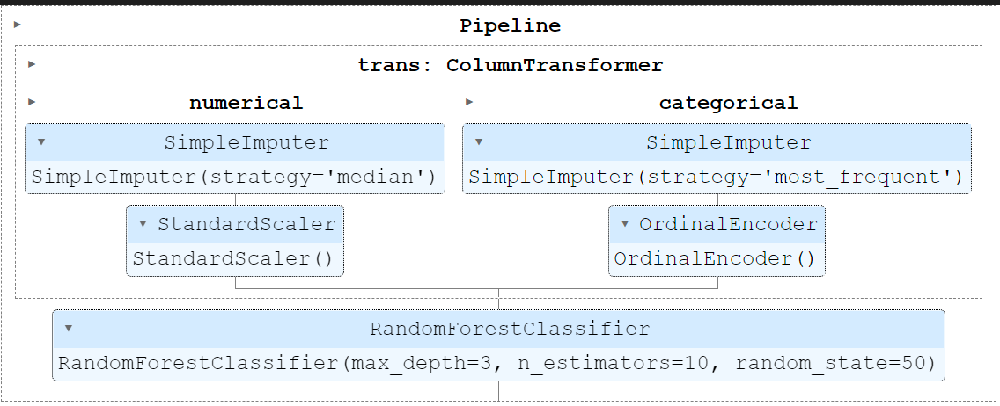
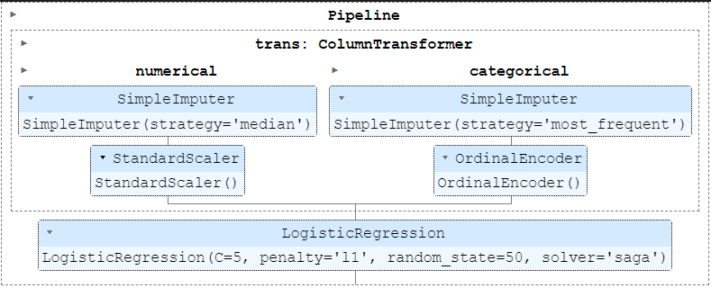
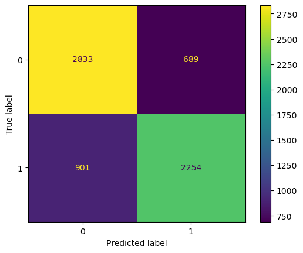
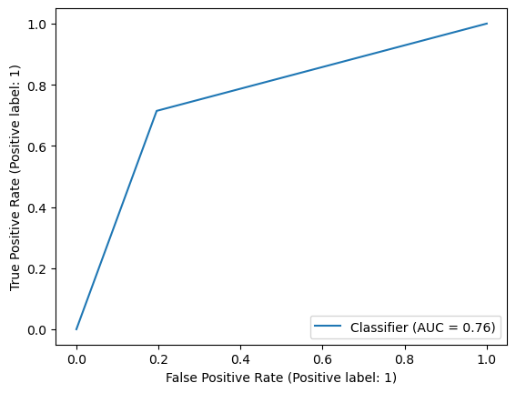

# Increasing Vaccine Adoption in Your City
<p align="center">
  
</p>

#### Team Members
Dietrich Nigh, Parker DeShazo

#### Summary of Repository Contents:
* National 2009 H1N1 Flu Survey data acquired from  [Driven Data](https://www.drivendata.org/competitions/66/flu-shot-learning/page/211/)
* Exploratory Notebooks from each member of this group
* A copy of our [final presentation](FinalPresentation.pdf) in PDF format
* A copy of our [final notebook](FinalNotebook.ipynb) containing detailed analysis and accompanying code

## Business Understanding of Problem

After the events of the last few years, the importance of vaccination campaigns cannot be overstated. COVID brought vaccine development and deployment to the forefront of our minds. The shortcomings were widely reported but COVID was a medical success story. However, the disease quickly stifled the vaccine's efficacy as binding sites rapidly evolved. 

The seasonal flu is another disease that requires freqent re-administration due to changes in the binding site of the virus. While we have known about this ailment for well over 100 years, vaccine adoption rates are not sufficiently high to achieve true herd immunity.

To further this aim, we here at VaccAmerica, an NGO specializating in predicting vaccine usage, have created a model to predict if an individual will vaccinate. Using the features from this final model, we provide recommendations on how to increase seasonal flu vaccine adoption rates.

Precision and the ROC-AUC score were used as the primary metrics for modeling. Precision was opted for to minimize the count of false positives in our predictions. False positives, or people predicted to get the vaccine that don't, negatively impact herd immunity as unvaccinated individuals are in the population. There is no penalty for predicting someone would not get the vaccine that did. ROC-AUC is the metric utilized in the competition the data was taken from. 

#### Limitations of Our Data

* Women were overrepresented
* White individuals were overrepresented
* Geological data was not translatable
* No data on religious or politic belief

###### Imbalance of Sex


###### Imbalance of Race


## Bottom Line

Through informing opinions, getting doctors onboard with recommendations, and targeting age groups < 40 years old municipalities will be able to increase the portion of their population that seeks the seasonal flu vaccine.

## Data Preparation

At the outset, the data was not in a usable state and preliminary cleaning needed to be performed.
Some of the data was unusable due to missing values and was dropped. The features were:
* employment_occupation
* employment_industry
* health_insurance
Additional data manipulation was done via a ColumnTransformer within our pipeline.
* Categorical and Numeric data was imputed 
* Categorical data was oridinally encoded
* Numeric data was standard scaled
Data was then seperated into train and test sets to prevent data leakage.

## Simple Model
To start our analysis off, we used a simple forest model. The use of this model allowed for an initial assessment of feature importance.



Our precision and roc-auc scores for this model, 68.12% and 0.7176 respectively, were lower than desired so additional modeling was needed. 

## Exploratory Modeling

A logistic regression using the features identified in the first decision tree was created. These features, opinion_seas_vacc_effective and doctor_recc_seasonal, were not sufficient. 

After this, a logistic regression capturing all predictors was made. The ROC-AUC score and the precision was signficantly higher, 0.7634 and 77.05% respectively. However, with 32 predictors, this would be an impractical model for municipalities with limited resources.

###### Total Logistic Regression Model



A Random Forest Model was constructed in an attempt to increase scores via bagging. An increase in scores from the logistic regression model was not seen. This model had an ROC-AUC score of 0.7321 and a precision of 74.96%. 

As there was no improvement, the logistic regression model was optimized in the model tuning phase.

###### Random Forest Model




#### Model Tuning
Model tuning in this case was handled via a grid search with feature selections coming from a previous iteration of the logistic regression model. Coefficent magnitude was the primary filter for selection of features. Otherwise, the best hyperparameters were acquired from the following grid:
```
log_reg_grid = {'log__C': stats.uniform(loc=0, scale=10),
               'log__l1_ratio': stats.expon(scale=0.2),
               'log__penalty': ['log__', 'l1', 'l2', 'elasticnet', None],
               'log__solver': ['lbfgs', 'newton-cg', 'newton-cholesky', 'sag', 'saga']}
 ```

## Final Model
Our final model included the following predictors:
* opinion_seas_risk              
* doctor_recc_seasonal           
* opinion_seas_vacc_effective    
* age_group                      
* health_worker                  
* opinion_seas_sick_from_vacc    

Our final precision and roc-auc scores were as follows:

* roc-auc score: 0.7593970343532301
* precision score: 0.7658851512062521



Despite removing 26 predictors, our final model only lost approximately 0.5% of its predictive power from the largest logistical regression model. The limited number of predictors affords this model more value for municipalities with limited resources. 

###### Confusion Matrix



###### ROC-AUC Curve




#### Implications (Coefficients)
With a one unit change in any of these factors, the odds of receiving change as follows:
* opinion_seas_risk              2.104511
* doctor_recc_seasonal           1.894827
* opinion_seas_vacc_effective    1.853458
* age_group                      1.326044
* health_worker                  0.723932
* opinion_seas_sick_from_vacc    1.509126

The results of our analysis show that opinions about the vaccine, recieving a doctor's recommendation, and certain demographic characteristics are predictive of an individual's choice to receive a seasonal flu vaccine. 

While a city may not be able to change someone's age or their employment type, they are able to put funding toward medical eduation. This education will hopefully influence peoples' attitudes toward the seasonal vaccine. For example, changing someone's opinion on the efficacy of the vaccine will cause 2.1 times increase in the odds that they recieve the vaccine. 

The city will also be able to divert toward younger age groups. We found that younger ages (<40 years of age) are far less likely to receive the vaccine. As such, campaigns should be concentrated on these groups to increase their adoption rates.

Our final model allows for strong predictive power on just six features. This will allow your city to more easily collect the requisite data. Additionally, the fewer number of features permits concentrated campaigns, rather than wasting resources on influencing factors that will not be impactful on vaccination rates.