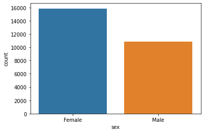
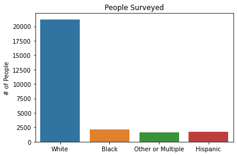

# Increasing Vaccine Adoption in Your City
<p align="center">
  
</p>

#### Team Members
Dietrich Nigh, Parker DeShazo

#### Summary of Repository Contents:
* National 2009 H1N1 Flu Survey data acquired from  [Driven Data](https://www.drivendata.org/competitions/66/flu-shot-learning/page/211/)
* Exploratory Notebooks from each member of this group
* A copy of our [final presentation(FinalPresentation.pdf)] in PDF format
* A copy of our [final notebook](FinalNotebook.ipynb) containing detailed analysis and accompanying code

## Business Understanding of Problem

After the events of the last few years, the importance of vaccination campaigns cannot be overstated. COVID brought vaccine development and deployment to the forefront of our minds. The shortcomings were widely reported but COVID was a medical success story. However, the disease quickly stifled the vaccine's efficacy as binding sites rapidly evolved. 

The seasonal flu is another disease that requires freqent re-administration due to changes in the binding site of the virus. While we have known about this ailment for well over 100 years, vaccine adoption rates are not sufficiently high to achieve true herd immunity.

To further this aim, we here at VaccAmerica, an NGO specializating in predicting vaccine usage, have created a model to predict if an individual will vaccinate. Using the features from this final model, we provide recommendations on how to increase seasonal flu vaccine adoption rates.

#### Limitations of Our Data

* Women were overrepresented
* White individuals were overrepresented
* Geological data was not translatable
* No data on religious or politic belief

###### Imbalance of Sex



###### Imbalance of Race



## Bottom Line

Through the proper setting and thoughtful allocation of lot real estate, profits can be maximized when developing in the Seattle Metro.

## Data Preparation

At the outset, the data was not in a usable state and preliminary cleaning needed to be performed.
Some of the data was unusable due to missing values. These categories were:
* 
Additional data manipulation was done via a ColumnTransformer within our pipeline.
* Categorical and Numeric data was imputed 
* Categorical data was oridinally encoded to be usealbe
* Numeric data was standard scaled
Data was then seperated into train and test sets to prevent data leakage.

## Simple Model


## Exploratory Modelling


#### Model Tuning
Model tuning in this case was handled via a grid search with feature additions from a previous iteration of the logistic regression model. Coefficent magnitude was the primary filter for selection of features. Otherwise, the best coefficients were grabbed from the following grid:
```
log_reg_grid = {'log__C': stats.uniform(loc=0, scale=10),
               'log__l1_ratio': stats.expon(scale=0.2),
               'log__penalty': ['log__', 'l1', 'l2', 'elasticnet', None],
               'log__solver': ['lbfgs', 'newton-cg', 'newton-cholesky', 'sag', 'saga']}
 ```

## Final Model
After removing factors due to their insignificance or due to multicollinearity, our final model included the following predictors:
* opinion_seas_risk              2.104511
* doctor_recc_seasonal           1.894827
* opinion_seas_vacc_effective    1.853458
* age_group                      1.326044
* health_worker                  0.723932
* opinion_seas_sick_from_vacc    1.509126

Our final precision and roc-auc scores were as follows:

* roc-auc score: 0.7593970343532301
* precision score: 0.7658851512062521


Despite removing 26 predictors, our final model only lost approximately 0.5% of its predictive power from the largest logistical regression model. The limited number of predictors affords this model more value for municipalities with limited resources. 


#### Implications (Coefficients)
With a one unit change in any of these factors, the odds of receiving change as follows:
* opinion_seas_risk              2.104511
* doctor_recc_seasonal           1.894827
* opinion_seas_vacc_effective    1.853458
* age_group                      1.326044
* health_worker                  0.723932
* opinion_seas_sick_from_vacc    1.509126